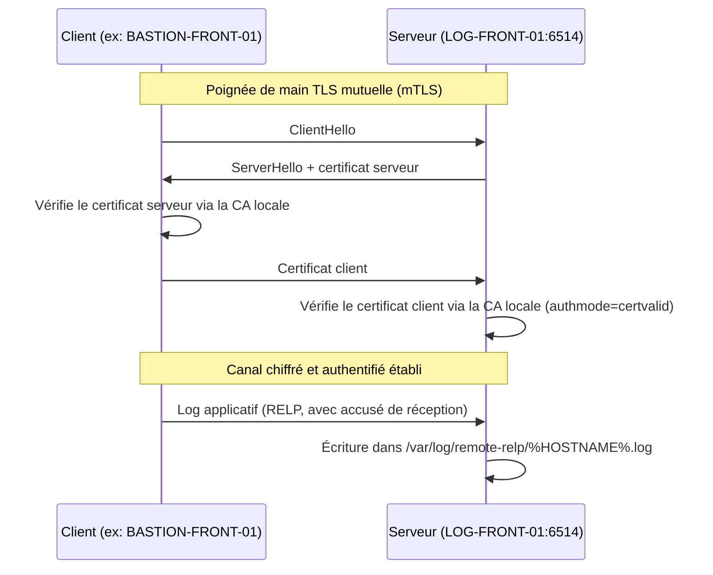

# Centralisation de logs sécurisée — rsyslog RELP + mTLS

> Lab réseau/sécurité réalisé en License L3 Systèmes Réseaux & Cloud Computing (module LPIC-102) : mise en place d'une remontée de logs chiffrée et authentifiée par certificat entre plusieurs machines Linux, sans casser le flux syslog existant.

## Contexte

Sur une infrastructure Linux, les logs sont souvent centralisés en clair via syslog/UDP (parfois TCP) classique — n'importe quelle machine du réseau peut alors injecter de faux logs, et le contenu transite en clair. Ce lab ajoute, **en complément** de l'existant, un second flux de collecte utilisant :

- **RELP** (Reliable Event Logging Protocol) au lieu de syslog/UDP/TCP simple, pour garantir l'accusé de réception de chaque message ;
- **mTLS** (TLS mutuel) : le serveur et chaque client s'authentifient mutuellement par certificat, signés par une CA locale dédiée.

Le tout est testé et déployé sur des VMs réelles (systemd + rsyslog natif) — l'objectif étant de rester au plus près des conditions réelles d'administration système visées par le LPIC-102.

## Architecture



- **Serveur** (`server/`) : `imrelp` en écoute sur le port `6514`, isolé du port `514` (flux syslog en clair déjà existant) via un `ruleset` dédié. Chaque client est trié dans son propre fichier via un template `%HOSTNAME%`.
- **Client** (`client/`) : `omrelp` capte les logs locaux (`imuxsock`) et les pousse en RELP+mTLS vers le serveur, avec un certificat propre à chaque machine (CN unique).
- **PKI** : une CA locale auto-signée signe un certificat serveur et un certificat par client. La clé privée de la CA ne quitte jamais la machine serveur.

## Preuve du chiffrement (démo)

Le dossier [`docs/demo.md`](docs/demo.md) détaille un scénario complet de démonstration en 6 étapes, avec `tcpdump` :

1. Le port `6514` (RELP+TLS) est bien isolé du port `514` existant.
2. Lancement de la capture réseau `tcpdump` avant l'envoi.
3. Un message identifiable est envoyé côté client.
4. La capture réseau confirme un enregistrement TLS "Application Data" (`17 03 03`), illisible en clair.
5. **Preuve négative** : le message envoyé n'apparaît nulle part dans la capture brute → confirme que le chiffrement est réel, pas juste déclaré dans la conf.
6. **Preuve positive** : le message arrive bien en clair dans le fichier de log côté serveur → le déchiffrement a eu lieu après authentification mutuelle, pas parce que le réseau laissait passer du clair.

## Reproduire le lab

```
+ # Cloner le repo
+ git clone https://github.com/D-Wicker/sentinel-relp-syslog.git
+ cd sentinel-relp-syslog
```

# 1. Sur le serveur (une seule fois) : génère la CA + le certificat serveur
./server/generate-ca-and-server.sh

# 2. Sur le ou les clients (une seule fois par client) : génère un certificat par machine cliente
./client/generate-client-cert.sh BASTION-FRONT-01 (ou nom de la machine)

# 3. Déployer relp-server.conf sur le serveur, relp-client.conf sur chaque client
```
    (remplacer __CN__ dans relp-client.conf par le hostname exact de la machine)
```

# 4. Redémarrer rsyslog des deux côtés
sudo systemctl restart rsyslog

# 5. Tester
logger "Test RELP+mTLS"
```
Documentation détaillée, ligne par ligne, des deux fichiers de configuration :
- [`docs/server-config.md`](docs/server-config.md)
- [`docs/client-config.md`](docs/client-config.md)

## Choix techniques et limites assumées

- **Pas de drop de privilèges** (`rsyslogd` tourne en root) : une seule instance rsyslogd sur la VM gère à la fois ce flux RELP et la conf système existante (`/var/log/auth.log`, etc.), qui nécessite des droits root/adm. Isoler proprement le drop de privilèges au seul flux RELP demanderait une seconde instance rsyslogd dédiée — hors périmètre de ce lab, documenté comme piste d'amélioration.
- **PKI volontairement simple** (CA auto-signée, pas de révocation/CRL) : suffisant pour un lab, insuffisant en production où une vraie gestion de cycle de vie des certificats (rotation, révocation) serait nécessaire.

## Documentation technique d'un sujet sécuritée rencontrer interressant

**pourquoi un compte de service rsyslog-svc a été envisagé, puis abandonné**

**Objectif initial :** appliquer le principe de moindre privilège au serveur RELP. Par défaut, rsyslogd tourne en root sur Debian (le paquet rsyslog ne crée d'ailleurs aucun utilisateur système dédié). Or cette machine (LOG-FRONT-01) est exposée sur le réseau via le port RELP 6514 et manipule des clés cryptographiques — faire tourner ce processus en root signifie qu'une faille exploitée dans rsyslogd ou dans OpenSSL donnerait à un attaquant les pleins droits root sur la machine.

**Mise en œuvre testée :** création d'un compte système dédié rsyslog-svc (UID 999, sans shell interactif), avec un chown de la clé privée serveur vers ce compte, et ajout des directives $PrivDropToUser rsyslog-svc / $PrivDropToGroup rsyslog-svc en fin de configuration — la logique voulue étant : rsyslogd démarre en root, ouvre le port 6514, charge les certificats, puis abandonne définitivement ses privilèges vers ce compte restreint pour tout le reste de son fonctionnement.

**Effet de bord découvert :** $PrivDropToUser ne cible pas un flux en particulier — il s'applique à l'ensemble du processus rsyslogd, qui n'existe qu'en une seule instance sur la machine et gère simultanément la configuration RELP ajoutée et la configuration système préexistante (écriture de /var/log/auth.log, /var/log/syslog, appartenant à root:adm). Une fois les privilèges droppés, ces écritures système ont échoué (Permission denied), provoquant une boucle de suspension de l'action interne omfile.

**Décision retenue et justification :** abandon du drop de privilèges. Isoler correctement ce mécanisme au seul flux RELP nécessiterait une seconde instance rsyslogd dédiée, avec son propre processus, sa propre configuration et ses propres permissions — une architecture à part entière, hors du périmètre de ce module. Le choix a donc été de conserver le comportement par défaut du paquet Debian (root), documenté explicitement comme un compromis assumé plutôt que comme un oubli, avec la seconde instance dédiée identifiée comme piste d'amélioration possible.

**Conséquence sur les permissions :** le chown rsyslog-svc:rsyslog-svc devenu sans objet a été retiré des scripts — rsyslogd tournant en root, les certificats et clés appartiennent désormais à root:root, ce qui est suffisant puisque root peut lire n'importe quel fichier indépendamment de son propriétaire déclaré.

## Stack

`rsyslog` · `RELP` (imrelp/omrelp) · `OpenSSL` (mTLS) · `systemd` · `tcpdump` (validation)
